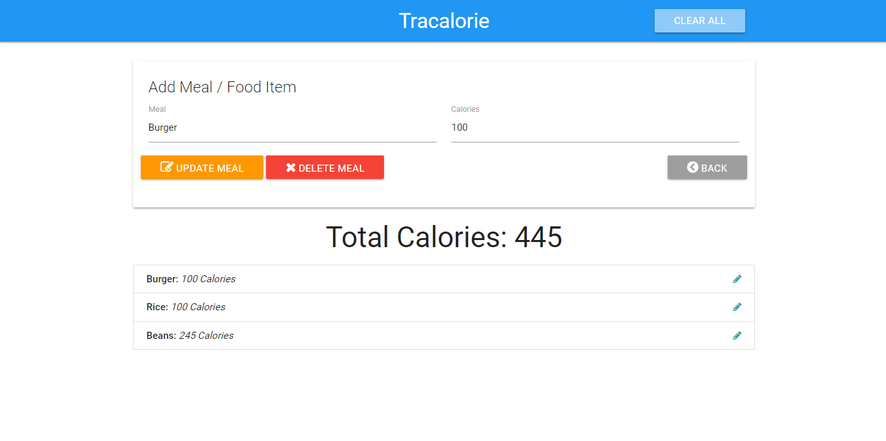

# Tracalorie App

Tracalorie is a simple calorie tracking application designed to help you keep track of your daily food intake. The app allows users to add, edit, and delete meals while automatically calculating the total number of calories consumed.

## Features

- Add Meals: Log meals by entering the name of the food and the number of calories.
- Edit and Update: Modify existing meal entries and update their calorie values.
- Delete Meals: Remove meals from the log as needed.
- Clear All: Option to clear the entire meal log in one click.
- Dynamic Total: Automatically updates the total calorie count based on the meals entered.

## Technologies Used

- Frontend: HTML, CSS, Bootstrap, JavaScript (for dynamic UI updates)
- Backend:Local Storage for client-side data persistence
- Version Control: Git

## Installation

To set up this project locally, follow these steps:

1. Clone the repository:
   ```bash
   git clone https://github.com/JosAk01/tracalories.git
   ```

2. Navigate to the project directory:
   ```bash
   cd tracalorie
   ```

3. Run the application:
   You can simply open the `index.html` file in your browser to run the app.


## Usage

1. Add Meals: Enter the meal name and the number of calories, then click `Add Meal`.
2. Edit Meals: Click the pencil icon next to a meal to update its name or calorie count.
3. Delete Meals: Click the trash icon or the `Delete Meal` button to remove meals.
4. Clear All: Click the `Clear All` button to reset the entire meal log.
5. View Total Calories: The app dynamically calculates and displays the total number of calories based on the entered meals.

## Screenshots


Screenshot of the Tracalorie App showing meals and total calories.

## Future Enhancements

- Calorie Goals: Allow users to set and track daily calorie goals.
- Nutritional Breakdown: Add more detailed nutritional information for each meal.
- User Authentication: Add user accounts for personalized meal tracking and history.

## Contributing

Contributions are welcome! If you'd like to help improve Tracalorie, please:

1. Fork the repository.
2. Create a new branch for your feature or bugfix.
3. Submit a pull request, and we will review your changes.

## Contact

For any questions or feedback, feel free to reach out to me at [akinremijoshua9@gmail.com](mailto:akinremijoshua9@gmail.com).
